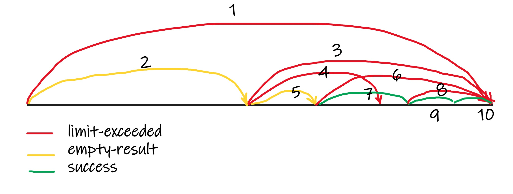

# Ethereum Scrapper

Solution to scarp ethereum event logs and store to elasticsearch.

## Quick start

```
docker-compose up
```

Then open browser `http://localhost:6002`


+ Setup you ethereum provider url, most often its from infura like this `https://mainnet.infura.io/v3/xxx`

+ Add contract address to scrap
+ Click `start` button. 

Start process will run, logs will be stored to  elasticsearh (started in docker container, data volume mounted to `.docker-data/elasticsearch`)

After some progress made you can explore data in kibana, open `http://localhost:5601/app/dev_tools#/console` 

Created index name for scrapper is  `{contract_address}_v1`


Use refresh button to update progress.
Scrapper could be paused and resumed, progress state will be stored. If some error occurs, scrapper will be set to `Failure` state, after it could be resumed.

Once scrapper finish to gather all data it will be scheduled to scrap new blocks with 1 minute interval.

Docker-compose run by default following services

+ Redis - DAPR store 
+ Elasticsearch - store scrapped data
+ Kibana - Elasticsearch client
+ Seq - log client, optional could be excluded by commenting it out, also should be commented `depends_on`
+ zipkin - tracing, optional commented by default

## Development

Application is set of [DAPR](https://dapr.io/) micro services


+ Web - web client React frontend (typescript)
+ API - asp net rest API (F#)
+ Dispatcher - DAPR actor (F#)
+ Scrapper - DAPR actor (node)
+ ElasticStore - DAPR actor (F#)

Every project folder contains `read.me` file with instructions how to start project locally with DAPR cli command. 

Every service contains `test.http` file which could be used to test service api calls.

### Web

`react/scrapper-web` 
client written in react to interact with API

### API

`dotnet/Eth/ScrapperAPI`
Rest API  
+ Proxy to Dispatcher actor
+ CRUD for `projects` and `versions`

Store is configurable via DAPR config

### Dispatcher

`dotnet/Eth/ScrapperDispatcherActor`

Stateful actor
+ Id is `{contract_address}_{version}`
+ Calculate next block range to request
+ Proxy call to Scrapper actor
+ Store current actor state 
+ Manage actor state via `start / pause / resume / reset`

State
```
  { Status: Status
    Request: ScrapperRequest
    Date: int64
    FinishDate: int64 option }
```

Store is configurable via DAPR config

#### Block range request calculator

Algorithm try to eagerly fetch as many blocks is it possible, in case of `limit-exceeded` error it will split current block by half, in case of `empty-result` and `success` will move to the next block



1. get all block from `0` to `latest`; returns `limit-exceeded`
2. since pervious result was `limit-exceeded` split pervious block by half, start from pervious `from`; returns `empty-result`
3. since pervious result was `empty-result` move `from` to pervious `to`, `to` to `latest`; returns `limit-exceeded`
4. since pervious result was `limit-exceeded` split pervious block by half, start from pervious `from`; returns `limit-exceeded`
5. since pervious result was `limit-exceeded` split pervious block by half, start from pervious `from`; returns `empty-result`
6. since pervious result was `empty-result` move `from` to pervious `to`, `to` to `latest`; returns `limit-exceeded`; 
7. since pervious result was `limit-exceeded` split pervious block by half, start from pervious `from`; returns `success`
8. since pervious result was `success` move `from` to pervious `to`, `to` to `latest`; returns `limit-exceeded`; 
9. since pervious result was `limit-exceeded` split pervious block by half, start from pervious `from`; returns `success`
10. since pervious result was `success` move `from` to pervious `to`, `to` to `latest`; returns `success`; 
11. Check `to` is `latest` and it `success` - finish scrapping


### Scrapper

`node/scrapper-actor`

Stateless actor, read web3 ethereum events within specified range, returns 
successful result or errors:
+ limit-exceeded - when number of events in requested block range exceeds 10000 web3 will return this error 
+ empty-result - if requested block contains no result
+ web3-failure - any unexpected failure from web3

In case of success actor will call `ElasticStore` actor
In case of error actor will call `Dispatcher` actor

### ElasticStore

`dotnet/Eth/ElasticStoreActor`

Stateless actor
+ Store data to elastcisearch
+ Call `dispatcher` actor in case of success / error

### Actors error handling

The fire / forget calls approach to actor architecture makes it hard to catch children errors. In contrast with other Actor libraries (Akka, Orleans) DAPR, doesn't provides utilities to help with child actor invocations and their failures.

The current implementation calling actor methods and waits for result, but actor methods themselves return call at once without waiting job done, this help to detect common actor call failure in case of child actor not available.

Consider `dispatcher` actor as root one, every expected error from other actors will be passed there with `Failure` method. Still for edge cases of unexpected errors in child actors there is no way to detect them, in this case it is possible to detect pending actors by the `State.date` field which contains latest update for the actor, when this `date` is not updated to long this is indication what something was broken along of the process and it pending.

### Start dapr services manually

Install dapr locally
Install [elastic](https://www.elastic.co/guide/en/elasticsearch/reference/current/run-elasticsearch-locally.html) locally

:warning: Use only 7.xxx version (7.17.6 at the moment), since its only compatible with !

:warning: Do not use `--network` from doc above if you want do elasticsearch queries directly

```

dapr run --app-port 5001 --app-id scrapper-api --components-path ./components -- dotnet watch run --project dotnet/Eth/ScrapperAPI 5001

dapr run --app-port 5002 --app-id job-manager-actor --components-path ./components -- dotnet watch run --project dotnet/Eth/JobManagerActor 5002

dapr run --app-port 5003 --app-id scrapper-dispatcher-actor --components-path ./components -- dotnet watch run --project dotnet/Eth/ScrapperDispatcherActor 5003

dapr run --app-port 5004 --app-id scrapper-elastic-store --components-path ./components -- dotnet watch run --project dotnet/Eth/ScrapperElasticStoreActor 5004

dapr run --app-port 5005 --app-id scrapper-actor --components-path ./components -- yarn --cwd ./node/scrapper-actor start 5005

yarn --cwd ./react/scrapper-web dev

```


