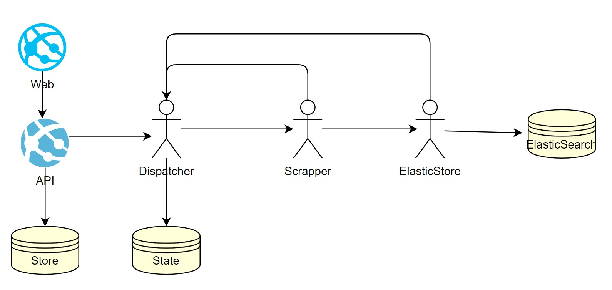

# Ethereum Scrapper

Solution to scarp ethereum event logs and store to elasticsearch.

## Quick start

```
docker-compose up
```

Then open browser `http://localhost:6002`


+ Setup you ethereum provider url, most often its from infura like this `https://mainnet.infura.io/v3/xxx`

+ Add contract address to scrap
+ Click `start` button. 

Start process will run, logs will be stored to  elasticsearh (started in docker container, data volume mounted to `.docker-data/elasticsearch`)

After some progress made you can explore data in kibana, open `http://localhost:5601/app/dev_tools#/console` 

Created index name for scrapper is  `{contract_address}_v1`


Use refresh button to update progress.
Scrapper could be paused and resumed, progress state will be stored. If some error occurs, scrapper will be set to `Failure` state, after it could be resumed

Once scrapper finish to gather all data it will be scheduled to scrap new blocks with 1 minute interval.

## Development

Application is set of [DAPR](https://dapr.io/) micro services



+ API - asp net rest API (F#)
+ Dispatcher - DAPR actor (F#)
+ Scrapper - DAPR actor (node)
+ ElastciStore - DAPR actor (F#)